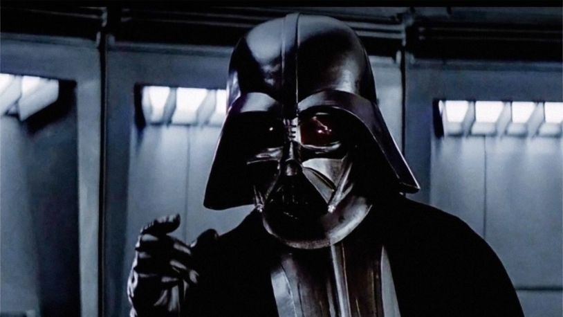
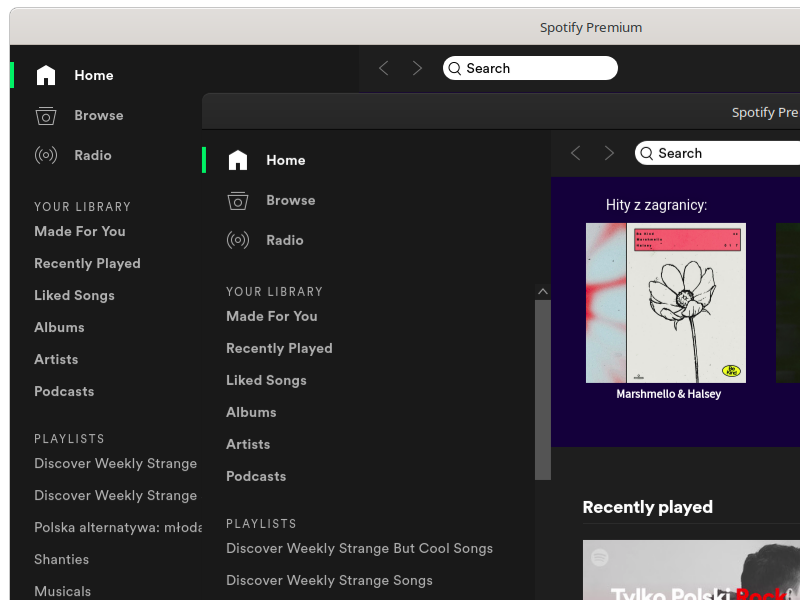

# Gnome Dark Apps
Join the dark side... 



Enable/set dark theme on a per-application basis. 

This is fix for ugly light bars on dark themed apps like Spotify, Discord, Jetbrains IDEs and other non Gnome apps.

## Install
Just use NPM or your package manager of choice. 

```
npm i -g gnome-dark-apps
```

## Configure

Set `gnome_dark_apps` as startup app. Or just call it from command line.

First check window class. Type `xprop -id ${windowId} WM_CLASS` command and click on window that you want to make dark themed.
Output should look like this:
```
WM_CLASS(STRING) = "spotify", "Spotify"
WM_CLASS(STRING) = "jetbrains-webstorm", "jetbrains-webstorm"
```

Put window classes in `~/.dark` file, split with newline.
You can use only part of class if you want set dark themes for more than one app (look at jetbrains config).

Example:
```
jetbrains
spotify
discord
```

After that simple steps you can enjoy dark themed apps on light theme.



## Contribution

Leave issue or something.

## License
MIT
